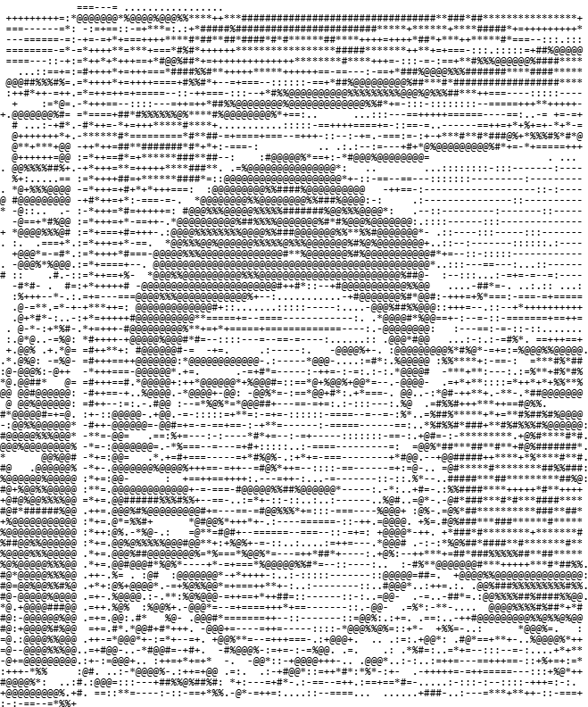

<table border="0" cellspacing="0" cellpadding="0" style="border: none; border-collapse: collapse; outline: none;">
  <tr>
    <td width="45%" align="center" style="border: none;">
      
    </td>
    <td width="55%" align="left" style="padding-left: 30px; border: none;">
      
        
      <a href="[your-resume-link]">
        _cat%20resume-13001F?style=for-the-badge&logo=readme&logoColor=white&labelColor=13001F&color=13001F" alt="Resume"/>
      </a>
        
      <a href="[your-portfolio-link]">
        _cd%20portfolio-13001F?style=for-the-badge&logo=google-chrome&logoColor=white&labelColor=13001F&color=13001F" alt="Portfolio"/>
      </a>
        
      <a href="https://www.linkedin.com/in/yking-ly">
        _ssh%20linkedin-13001F?style=for-the-badge&logo=linkedin&logoColor=white&labelColor=13001F&color=13001F" alt="LinkedIn"/>
      </a>
        
      <a href="[your-leetcode-link]">
        _gcc%20leetcode-13001F?style=for-the-badge&logo=leetcode&logoColor=white&labelColor=13001F&color=13001F" alt="LeetCode"/>
      </a>
        
      <a href="https://www.codechef.com/users/yking_ly">
        _./ codechef-13001F?style=for-the-badge&logo=codechef&logoColor=white&labelColor=13001F&color=13001F" alt="CodeChef"/>
      </a>
    </td>
  </tr>
</table>

 

 

  

  

<h3>Profile Views</h3>

